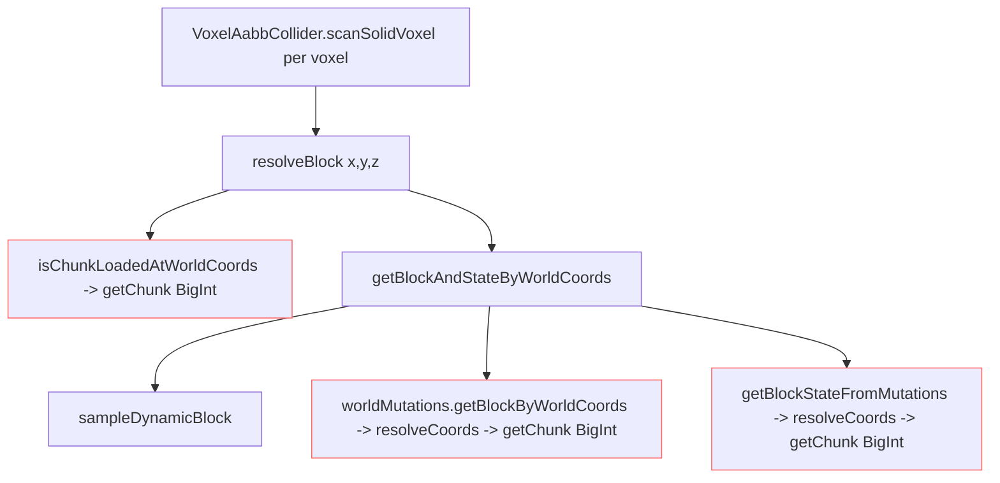
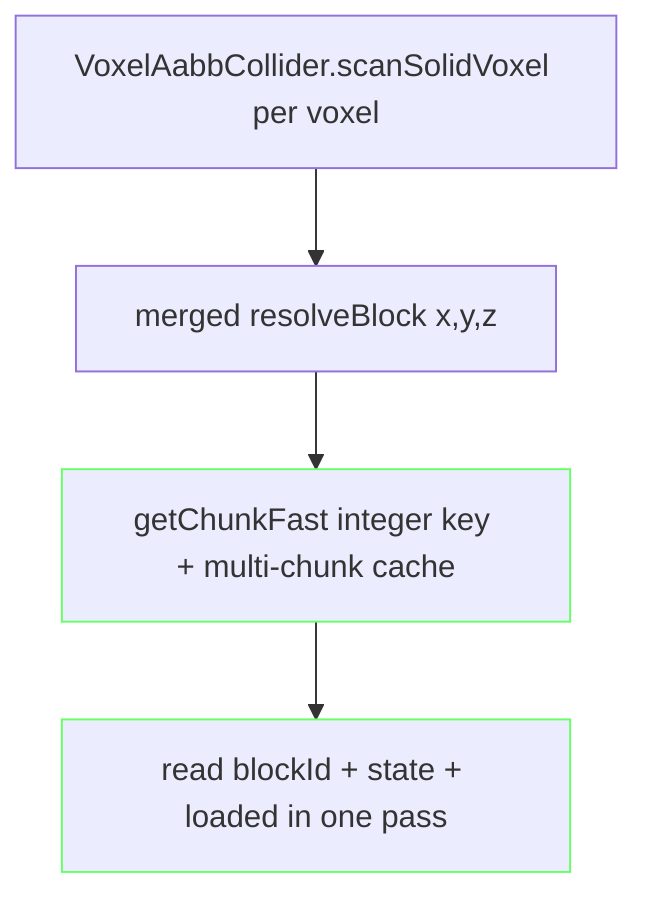
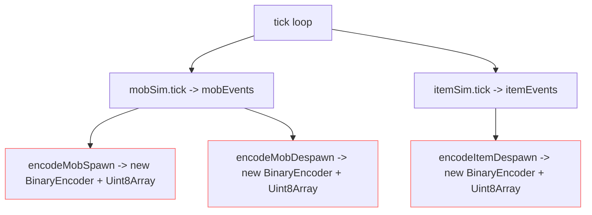

# Micro-Optimization Findings

Scope: broad sweep for micro-optimizations across the voxel engine — client
(collision, meshing worker, occlusion), and server/multiplayer (relay, GC
pressure). The meshing pipeline (`VoxelMaskExtractor`, `BlockInfoCache`), the
occlusion culler (`OcclusionCuller`), the server tick loop (`VoxelRoom.tick`),
and the worker mesh-output pool are already heavily optimized. The remaining
wins cluster in **per-voxel / per-event allocation and redundant chunk
resolution**.

## Root cause (client)

`getChunk(cx,cy,cz)` resolves chunks via `packCoords`, which allocates **3
BigInts + bit ops per call** (`ChunkCoords.ts:15`). Hot per-voxel resolvers call
it 2–3× redundantly, and the single-entry chunk caches (`_probeCache` in
`PlayerVehicleMotor.ts:104`, `resolveCoords` in `ChunkWorldMutations.ts:83`) miss
~50% of the time because an AABB sweep spans up to 2 chunks per axis.

## Collision resolver call path (centerpiece)

Target after fix: one integer-keyed chunk resolution + one block/state read per voxel.

## Server broadcast path

Batch broadcasts already reuse a `BinaryEncoder` and `getBytes()` returns a
**subarray view (no copy)** — so `writePlayerStateBatch`/`writeMobUpdateBatch`/
`writeItemUpdateBatch` are allocation-free. The leak is the **per-event encode
helpers**, which each do `new BinaryEncoder(N)` (fresh backing `Uint8Array`) per
call, and these run inside `tick()` for every mob spawn/despawn and item
despawn event.

Target: route these through a reusable scratch encoder (as the batch writers
already do).

## Concrete items (see todo list)

Client / collision (highest value, per-frame + per-voxel):
1. Integer-keyed `getChunkFast` to replace BigInt `packCoords` in hot paths.
2. Merge player collision resolver's loaded-check + block/state read (eliminate 2–3 `getChunk`/resolveCoords per voxel).
3. `NeutralMob.ts:168` uses two separate world→coord calls; collapse to one `getBlockAndStateByWorldCoords`.
4. Upgrade single-chunk caches to a small multi-chunk cache (sweeps span ≤2 chunks/axis).
5. Short-circuit `sampleDynamicBlock` when no dynamic providers are near the player.
6. Route `getLightByWorldCoords` through the integer-keyed fast path.
7. `Math.hypot` → `Math.sqrt(x*x+y*y+z*z)` in `OcclusionCuller.setFrustumPlane` (minor).
8. Verify `processCell` in `VoxelMaskExtractor` for redundant per-cell probes before changing.

Server / multiplayer (GC pressure the benchmark measures):
9. Reuse a scratch `BinaryEncoder` for per-event encode helpers (`encodeMobSpawn/Despawn`, `encodeItemDespawn/Spawn`, `encodePlayerJoin/Leave`) instead of `new BinaryEncoder` per call.
10. Reuse a scratch object for the `playerPositionCache` save payload instead of allocating per `PLAYER_SAVE_INTERVAL`.

Meshing worker:
11. Replace the O(n) linear scan in `takePooledMeshBuffer` with a size-keyed `Map` for O(1) lookup (pool ≤96 buffers, 9 lookups/mesh).
12. Preallocate/reuse the `localTransferables` array and `FullMeshMessage` object in `postMeshResponse` to avoid per-mesh allocation.

## Notes

- Items 1–5 and 9 are the highest value. Items 6–8, 10–12 are low-risk polish.
- The meshing pipeline, occlusion culler, server tick loop, and worker output
  pool are already well-tuned — no changes proposed there beyond 11–12.
- No changes made yet — this is a findings/plan document.
